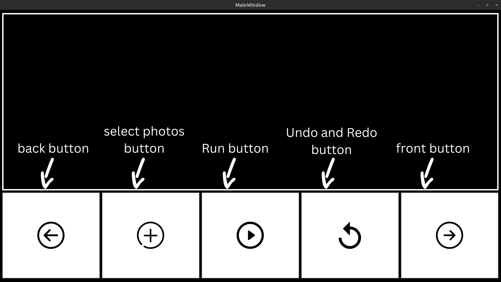
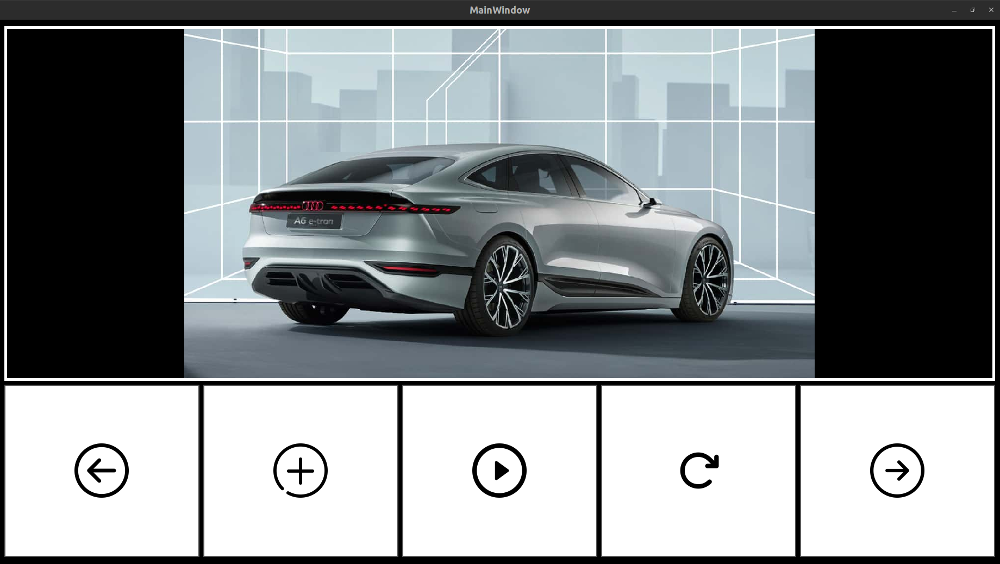
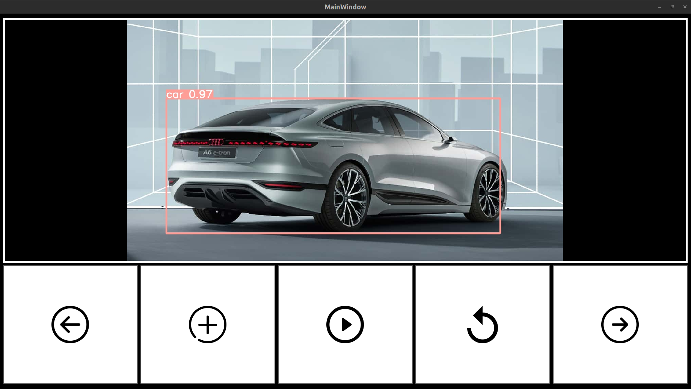

# Vehicle_detection
A python application used for detecting cars, vans, motorcycles, buses, threewheels, and trucks using Yolov8 for training and detection and pyqt5 for GUI.
For the training of the model, I've used kaggle dataset which can be found [here](https://www.kaggle.com/datasets/nadinpethiyagoda/vehicle-dataset-for-yolo/).
## Installation
1. Clone the repository
```bash
git clone https://github.com/husseinkhaled733/Vehicle_detection.git
```
2. Install the required packages

## Usage


1. Press the Select photos button to select the photos you want to detect vehicles in.
2. You can select multiple photos and change the photo displayed on the screen from back and front buttons.
3. Press the run button to start the detection process.
4. You can change the result photo by pressing the back and front buttons.
5. You can see the original photo from the detected photo and vice versa by pressing the undo and redo button.

## Example
original photo


result photo


## Other
You can find the weights and results of training the model in the train folder.

